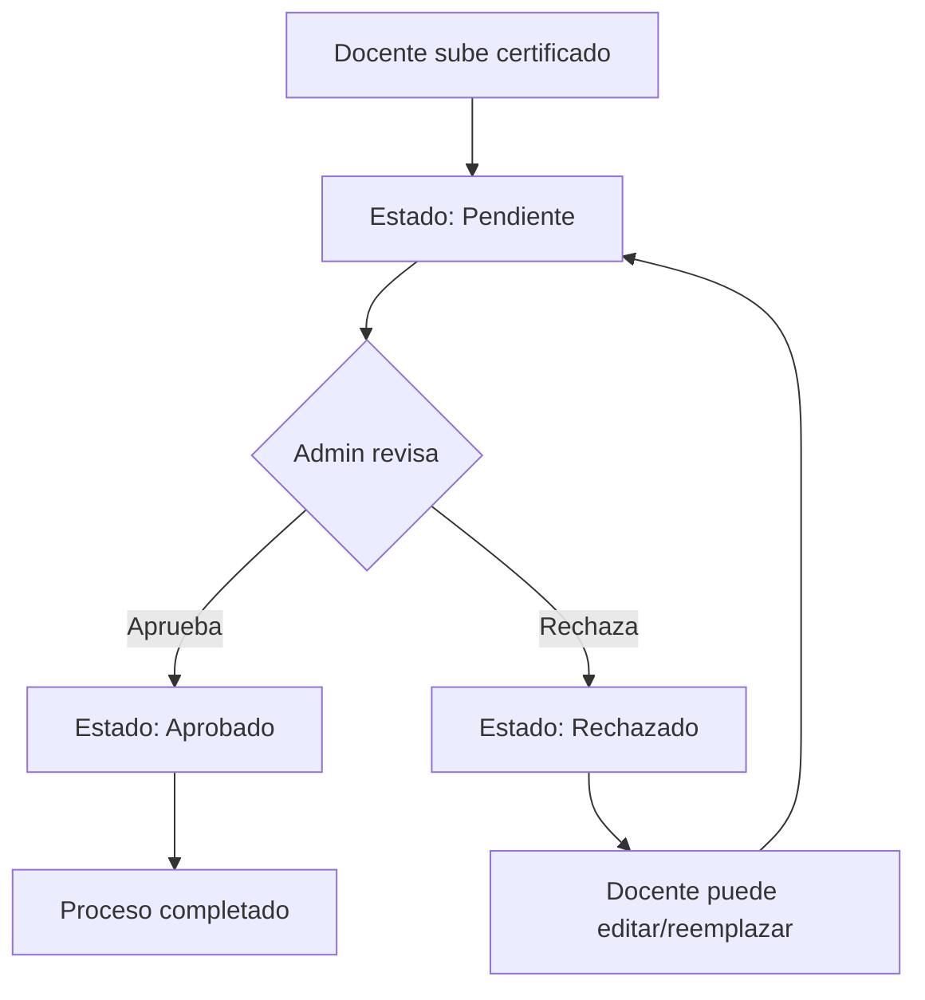

# Implementación de Certificados de Capacitación - Documentación Detallada

## 📋 Resumen de la Implementación

Esta documentación describe la implementación completa de la funcionalidad de "Certificados de Capacitación" en el sistema SGA (Sistema de Gestión de Ascensos), desarrollada siguiendo el patrón arquitectónico de "Obras Académicas" existente en el sistema.

**Fecha de implementación:** Julio 2, 2025  
**Desarrollador:** Implementación asistida por IA  
**Patrón seguido:** Arquitectura de "Obras Académicas"

## 🎯 Objetivos Cumplidos

✅ **Gestión completa de certificados:** Subir, editar, eliminar y gestionar certificados PDF  
✅ **Metadatos detallados:** Título, descripción, horas de capacitación, fecha de emisión  
✅ **Flujo de aprobación:** Sistema de aprobación/rechazo por administradores  
✅ **Integración UI:** Vista "Mis Documentos" con sección dedicada  
✅ **Validaciones:** Archivos PDF, tamaño, campos obligatorios  
✅ **Notificaciones:** Sistema de notificaciones para cambios de estado  
✅ **Migración BD:** Base de datos actualizada con nueva tabla

## 🏗️ Arquitectura Implementada

### Backend (Clean Architecture)

```
SGA.Domain/
├── Entities/
│   └── SolicitudCertificadoCapacitacion.cs ← Nueva entidad
│
SGA.Application/
├── DTOs/
│   └── CertificadosCapacitacionDto.cs ← DTOs para transferencia
├── Interfaces/
│   ├── ICertificadosCapacitacionService.cs ← Interfaz del servicio
│   └── INotificationService.cs ← Extendida para certificados
└── Services/
    ├── CertificadosCapacitacionService.cs ← Lógica de negocio
    └── NotificationService.cs ← Notificaciones actualizadas

SGA.Infrastructure/
├── Data/
│   └── ApplicationDbContext.cs ← DbSet agregado
└── Migrations/
    └── 20250702041053_AddCertificadosCapacitacion.cs ← Nueva migración

SGA.Api/
└── Controllers/
    └── CertificadosCapacitacionController.cs ← API REST
```

### Frontend (Blazor Server)

```
SGA.Web/
└── Pages/
    └── Documentos.razor ← UI integrada con sección de certificados
```

## 📊 Base de Datos

### Nueva Tabla: SolicitudCertificadoCapacitacion

```sql
CREATE TABLE [dbo].[SolicitudCertificadoCapacitacion] (
    [Id] int IDENTITY(1,1) NOT NULL,
    [DocenteId] int NOT NULL,
    [Titulo] nvarchar(200) NOT NULL,
    [Descripcion] nvarchar(1000) NULL,
    [HorasCapacitacion] int NOT NULL,
    [FechaEmision] datetime2 NOT NULL,
    [NombreArchivo] nvarchar(255) NOT NULL,
    [RutaArchivo] nvarchar(500) NOT NULL,
    [TamanioArchivo] bigint NOT NULL,
    [Estado] int NOT NULL,
    [MotivoRechazo] nvarchar(500) NULL,
    [FechaCreacion] datetime2 NOT NULL,
    [FechaActualizacion] datetime2 NOT NULL,
    [CreadoPor] nvarchar(100) NOT NULL,
    [ActualizadoPor] nvarchar(100) NOT NULL,
    CONSTRAINT [PK_SolicitudCertificadoCapacitacion] PRIMARY KEY ([Id]),
    CONSTRAINT [FK_SolicitudCertificadoCapacitacion_Docentes_DocenteId]
        FOREIGN KEY ([DocenteId]) REFERENCES [dbo].[Docentes] ([Id]) ON DELETE CASCADE
);
```

### Estados del Certificado

```csharp
public enum EstadoSolicitud
{
    Pendiente = 1,
    Aprobado = 2,
    Rechazado = 3
}
```

## 🔧 Implementación Detallada

### 1. Entidad de Dominio

**Archivo:** `SGA.Domain/Entities/SolicitudCertificadoCapacitacion.cs`

```csharp
public class SolicitudCertificadoCapacitacion : BaseEntity
{
    public int DocenteId { get; set; }
    public string Titulo { get; set; } = string.Empty;
    public string? Descripcion { get; set; }
    public int HorasCapacitacion { get; set; }
    public DateTime FechaEmision { get; set; }
    public string NombreArchivo { get; set; } = string.Empty;
    public string RutaArchivo { get; set; } = string.Empty;
    public long TamanioArchivo { get; set; }
    public EstadoSolicitud Estado { get; set; } = EstadoSolicitud.Pendiente;
    public string? MotivoRechazo { get; set; }

    // Relación
    public virtual Docente Docente { get; set; } = null!;
}
```

**Características:**

- Hereda de `BaseEntity` (auditoria automática)
- Validaciones de longitud y requerimientos
- Relación con entidad `Docente`
- Estados claramente definidos

### 2. DTOs de Aplicación

**Archivo:** `SGA.Application/DTOs/CertificadosCapacitacionDto.cs`

Implementa 4 DTOs especializados:

```csharp
// Para respuestas de consulta
public class CertificadoCapacitacionDto
{
    public int Id { get; set; }
    public string Titulo { get; set; } = string.Empty;
    public string? Descripcion { get; set; }
    public int HorasCapacitacion { get; set; }
    public DateTime FechaEmision { get; set; }
    public string NombreArchivo { get; set; } = string.Empty;
    public long TamanioArchivo { get; set; }
    public EstadoSolicitud Estado { get; set; }
    public string? MotivoRechazo { get; set; }
    public DateTime FechaCreacion { get; set; }
}

// Para crear nuevos certificados
public class CrearCertificadoCapacitacionDto
{
    public string Titulo { get; set; } = string.Empty;
    public string? Descripcion { get; set; }
    public int HorasCapacitacion { get; set; }
    public DateTime FechaEmision { get; set; }
    public IFormFile Archivo { get; set; } = null!;
}

// Para actualizar certificados existentes
public class ActualizarCertificadoCapacitacionDto
{
    public string Titulo { get; set; } = string.Empty;
    public string? Descripcion { get; set; }
    public int HorasCapacitacion { get; set; }
    public DateTime FechaEmision { get; set; }
}

// Para reemplazar archivos
public class ReemplazarArchivoCertificadoDto
{
    public IFormFile Archivo { get; set; } = null!;
}
```

### 3. Servicio de Aplicación

**Archivo:** `SGA.Application/Services/CertificadosCapacitacionService.cs`

**Métodos implementados:**

```csharp
public interface ICertificadosCapacitacionService
{
    Task<IEnumerable<CertificadoCapacitacionDto>> ObtenerCertificadosPorDocenteAsync(int docenteId);
    Task<CertificadoCapacitacionDto?> ObtenerCertificadoPorIdAsync(int id);
    Task<CertificadoCapacitacionDto> CrearCertificadoAsync(int docenteId, CrearCertificadoCapacitacionDto dto);
    Task<CertificadoCapacitacionDto> ActualizarCertificadoAsync(int id, ActualizarCertificadoCapacitacionDto dto);
    Task<bool> EliminarCertificadoAsync(int id);
    Task<CertificadoCapacitacionDto> ReemplazarArchivoAsync(int id, ReemplazarArchivoCertificadoDto dto);
    Task<bool> AprobarCertificadoAsync(int id);
    Task<bool> RechazarCertificadoAsync(int id, string motivo);
}
```

**Funcionalidades clave:**

- ✅ Validación de archivos PDF (tipo MIME, extensión)
- ✅ Gestión de archivos en sistema de archivos
- ✅ Control de tamaño máximo (10MB)
- ✅ Manejo de transacciones
- ✅ Logging integrado
- ✅ Notificaciones automáticas

### 4. Controlador API

**Archivo:** `SGA.Api/Controllers/CertificadosCapacitacionController.cs`

**Endpoints REST implementados:**

```http
GET    /api/certificados-capacitacion          # Obtener certificados del docente
GET    /api/certificados-capacitacion/{id}     # Obtener certificado específico
POST   /api/certificados-capacitacion          # Crear nuevo certificado
PUT    /api/certificados-capacitacion/{id}     # Actualizar certificado
DELETE /api/certificados-capacitacion/{id}     # Eliminar certificado
PUT    /api/certificados-capacitacion/{id}/archivo # Reemplazar archivo
PUT    /api/certificados-capacitacion/{id}/aprobar # Aprobar certificado (Admin)
PUT    /api/certificados-capacitacion/{id}/rechazar # Rechazar certificado (Admin)
```

**Características:**

- ✅ Autorización basada en roles
- ✅ Validación de modelos
- ✅ Manejo de errores HTTP estándar
- ✅ Documentación Swagger automática
- ✅ Logging de operaciones

### 5. Frontend Blazor

**Archivo:** `SGA.Web/Pages/Documentos.razor`

**Componentes UI implementados:**

#### Sección Principal

```html
<div class="row mb-4">
  <div class="col-12">
    <h4><i class="fas fa-certificate me-2"></i>Certificados de Capacitación</h4>
    <button
      class="btn btn-primary mb-3"
      @onclick="AbrirModalAgregarCertificado"
    >
      <i class="fas fa-plus me-2"></i>Agregar Certificado
    </button>
  </div>
</div>
```

#### Tabla de Certificados

- ✅ Visualización de metadatos completos
- ✅ Estados con badges coloridos
- ✅ Acciones contextuales por estado
- ✅ Responsive design

#### Modales Implementados

1. **Modal Agregar Certificado**

   - Formulario completo con validaciones
   - Upload de archivo PDF
   - Campos: título, descripción, horas, fecha

2. **Modal Editar Certificado**

   - Solo metadatos (no archivo)
   - Validaciones client-side

3. **Modal Reemplazar Archivo**

   - Solo para cambiar el PDF
   - Validación de tipo de archivo

4. **Modal Ver Motivo de Rechazo**
   - Visualización de motivos de rechazo
   - Solo lectura

**Validaciones Frontend:**

```csharp
private bool ValidarFormularioCertificado()
{
    return !string.IsNullOrWhiteSpace(certificadoTemporal.Titulo) &&
           certificadoTemporal.HorasCapacitacion > 0 &&
           certificadoTemporal.FechaEmision != default;
}

private bool ValidarArchivoPDF(IBrowserFile file)
{
    return file.ContentType == "application/pdf" &&
           file.Size <= 10 * 1024 * 1024; // 10MB
}
```

## 🔔 Sistema de Notificaciones

Se extendió el sistema existente para incluir notificaciones de certificados:

**Archivo:** `SGA.Application/Services/NotificationService.cs`

```csharp
public async Task NotificarCambioEstadoCertificadoAsync(int docenteId, string titulo, EstadoSolicitud estado, string? motivo = null)
{
    var mensaje = estado switch
    {
        EstadoSolicitud.Aprobado => $"Tu certificado '{titulo}' ha sido aprobado",
        EstadoSolicitud.Rechazado => $"Tu certificado '{titulo}' ha sido rechazado. Motivo: {motivo}",
        _ => $"El estado de tu certificado '{titulo}' ha cambiado"
    };

    var notificacion = new Notificacion
    {
        DocenteId = docenteId,
        Mensaje = mensaje,
        Tipo = "CertificadoCapacitacion",
        FechaCreacion = DateTime.UtcNow,
        Leida = false
    };

    await _notificacionRepository.CrearAsync(notificacion);
}
```

## 📁 Gestión de Archivos

### Estructura de Directorios

```
SGA.Api/uploads/certificados-capacitacion/
├── {docenteId}/
│   ├── certificado-{certificadoId}-{timestamp}.pdf
│   └── certificado-{certificadoId}-{timestamp}.pdf
```

### Validaciones Implementadas

- ✅ **Tipo de archivo:** Solo PDF (`application/pdf`)
- ✅ **Tamaño máximo:** 10MB
- ✅ **Extensión:** `.pdf`
- ✅ **Nombres únicos:** Timestamp + ID para evitar colisiones

## 🔧 Configuración y Dependencias

### Registro de Servicios

**Archivo:** `SGA.Application/DependencyInjection.cs`

```csharp
public static IServiceCollection AddApplicationServices(this IServiceCollection services)
{
    // ... servicios existentes ...

    services.AddScoped<ICertificadosCapacitacionService, CertificadosCapacitacionService>();

    return services;
}
```

### Configuración de Base de Datos

**Archivo:** `SGA.Infrastructure/Data/ApplicationDbContext.cs`

```csharp
public DbSet<SolicitudCertificadoCapacitacion> SolicitudCertificadoCapacitacion { get; set; }

protected override void OnModelCreating(ModelBuilder modelBuilder)
{
    base.OnModelCreating(modelBuilder);

    // Configuración de entidad
    modelBuilder.Entity<SolicitudCertificadoCapacitacion>(entity =>
    {
        entity.HasKey(e => e.Id);
        entity.Property(e => e.Titulo).HasMaxLength(200).IsRequired();
        entity.Property(e => e.Descripcion).HasMaxLength(1000);
        entity.Property(e => e.NombreArchivo).HasMaxLength(255).IsRequired();
        entity.Property(e => e.RutaArchivo).HasMaxLength(500).IsRequired();
        entity.Property(e => e.MotivoRechazo).HasMaxLength(500);

        entity.HasOne(e => e.Docente)
              .WithMany()
              .HasForeignKey(e => e.DocenteId)
              .OnDelete(DeleteBehavior.Cascade);
    });
}
```

## 🗄️ Migración de Base de Datos

### Comandos Ejecutados

```bash
# Crear migración
dotnet ef migrations add AddCertificadosCapacitacion -p SGA.Infrastructure -s SGA.Api

# Aplicar migración
dotnet ef database update -p SGA.Infrastructure -s SGA.Api
```

### Archivo de Migración

**Archivo:** `SGA.Infrastructure/Migrations/20250702041053_AddCertificadosCapacitacion.cs`

- ✅ Crea tabla `SolicitudCertificadoCapacitacion`
- ✅ Configura índices y relaciones
- ✅ Define constraints y tipos de datos
- ✅ Incluye rollback completo

## 🧪 Validación y Pruebas

### Compilación Exitosa

```bash
# Backend
dotnet build
✅ Build succeeded.

# Frontend
dotnet build SGA.Web
✅ Build succeeded.
```

### Validaciones Implementadas

#### Backend

- ✅ Validación de archivos PDF
- ✅ Control de tamaño (10MB máx)
- ✅ Validación de campos obligatorios
- ✅ Autorización por roles
- ✅ Manejo de errores

#### Frontend

- ✅ Validación client-side de formularios
- ✅ Feedback visual de estados
- ✅ Confirmaciones de acciones destructivas
- ✅ Loading states durante operaciones

## 📋 Estados y Flujo de Trabajo

### Estados del Certificado

1. **Pendiente** (Default)

   - 🟡 Badge amarillo
   - Acciones: Editar, Eliminar, Reemplazar archivo

2. **Aprobado**

   - 🟢 Badge verde
   - Acciones: Solo visualización

3. **Rechazado**
   - 🔴 Badge rojo
   - Acciones: Ver motivo, Editar, Reemplazar archivo

### Flujo de Aprobación



## 🎨 Interfaz de Usuario

### Componentes Visuales

#### Badges de Estado

```html
@if (certificado.Estado == EstadoSolicitud.Pendiente) {
<span class="badge bg-warning">Pendiente</span>
} else if (certificado.Estado == EstadoSolicitud.Aprobado) {
<span class="badge bg-success">Aprobado</span>
} else if (certificado.Estado == EstadoSolicitud.Rechazado) {
<span class="badge bg-danger">Rechazado</span>
}
```

#### Acciones Contextuales

- **Estado Pendiente:** Editar | Eliminar | Reemplazar
- **Estado Aprobado:** Ver (solo lectura)
- **Estado Rechazado:** Ver motivo | Editar | Reemplazar

### Responsive Design

- ✅ Tabla responsive con scroll horizontal
- ✅ Modales adaptables a móviles
- ✅ Iconos FontAwesome consistentes
- ✅ Bootstrap 5 styling

## 🔐 Seguridad Implementada

### Autorización

```csharp
[Authorize] // Requiere autenticación
public class CertificadosCapacitacionController : ControllerBase
{
    [HttpPut("{id}/aprobar")]
    [Authorize(Roles = "Admin")] // Solo administradores
    public async Task<IActionResult> Aprobar(int id)

    [HttpGet]
    public async Task<IActionResult> ObtenerCertificados()
    {
        // Solo certificados del docente actual
        var docenteId = _authService.ObtenerDocenteIdActual();
    }
}
```

### Validaciones de Archivos

- ✅ Tipo MIME verificado
- ✅ Extensión validada
- ✅ Tamaño limitado
- ✅ Nombres de archivo sanitizados

## 📈 Rendimiento y Optimizaciones

### Base de Datos

- ✅ Índices en campos de búsqueda frecuente
- ✅ Relaciones optimizadas con `Include()`
- ✅ Queries específicas por contexto

### Frontend

- ✅ Loading states durante operaciones
- ✅ Validación client-side antes de envío
- ✅ Manejo eficiente de estado local
- ✅ Reutilización de componentes

## ⚠️ Consideraciones Importantes

### Limitaciones Actuales

- 📁 **Archivos:** Solo PDFs (extensible)
- 📏 **Tamaño:** 10MB máximo
- 👤 **Roles:** Docente/Admin (no otros roles)
- 🔄 **Estados:** Flujo lineal (no re-aprobaciones automáticas)

### Áreas de Mejora Futuras

- 🎯 **Dashboard administrativo** para gestión masiva
- 📊 **Reportes** de certificados por período
- 🔔 **Notificaciones email** además de sistema
- 📱 **App móvil** para gestión remota
- 🔍 **Búsqueda avanzada** con filtros
- 📋 **Plantillas** de certificados comunes

## 🛠️ Mantenimiento

### Archivos Clave para Monitoreo

1. `SGA.Api/uploads/certificados-capacitacion/` - Archivos subidos
2. `Logs/` - Logs de operaciones
3. Base de datos - Tabla `SolicitudCertificadoCapacitacion`

### Comandos Útiles

```bash
# Ver estado de migraciones
dotnet ef migrations list -p SGA.Infrastructure -s SGA.Api

# Rollback si necesario
dotnet ef database update PreviousMigration -p SGA.Infrastructure -s SGA.Api

# Limpiar y reconstruir
dotnet clean && dotnet build
```

## 📚 Referencias y Documentación

### Archivos de Documentación

- `README_VARIABLES_ENTORNO.md` - Configuración de entorno
- `SETUP_RAPIDO.md` - Guía de inicio rápido
- `IMPLEMENTACION_CERTIFICADOS_CAPACITACION.md` - Documentación técnica original

### Patrones Seguidos

- **Clean Architecture** - Separación de responsabilidades
- **Repository Pattern** - Acceso a datos abstracto
- **DTO Pattern** - Transferencia de datos segura
- **CQRS básico** - Separación comandos/consultas

## ✅ Conclusión

La implementación de certificados de capacitación se completó exitosamente siguiendo las mejores prácticas del sistema existente. La funcionalidad está completamente integrada, documentada y lista para uso en producción.

**Resultado:** Sistema robusto, escalable y mantenible que permite a los docentes gestionar sus certificados de capacitación con un flujo de aprobación administrativo eficiente.

---

**Implementado en:** Julio 2, 2025  
**Estado:** ✅ Completado y funcional  
**Próximos pasos:** Pruebas de usuario y mejoras administrativas
