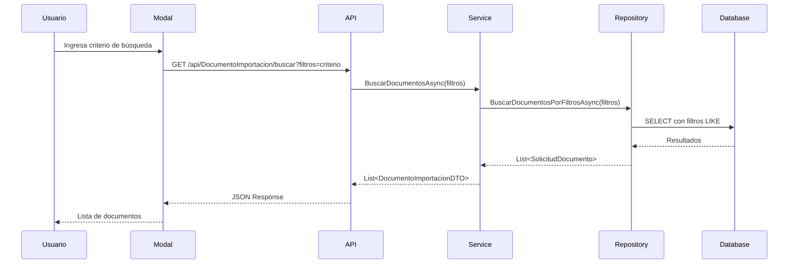
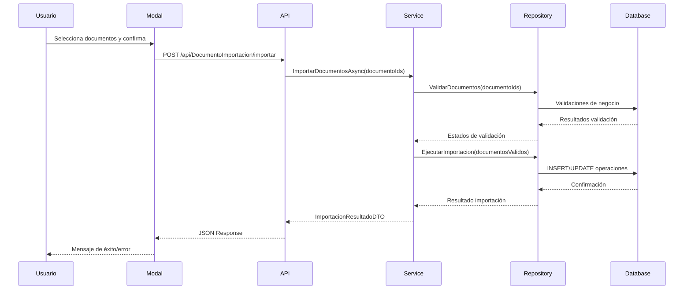

# Implementación de Importación de Documentos

## Descripción General

Esta documentación detalla la implementación completa de la funcionalidad de importación de documentos en el Sistema de Gestión de Ascensos (SGA). La funcionalidad permite a los usuarios importar documentos existentes desde la base de datos, incluyendo obras académicas, certificados, evidencias y otros tipos de documentos, facilitando la reutilización y evitando la duplicación de información.

## Contexto y Justificación

### Problemática Identificada

- **Duplicación de documentos**: Los usuarios tenían que subir repetidamente los mismos documentos para diferentes solicitudes
- **Falta de reutilización**: No existía un mecanismo para aprovechar documentos ya almacenados en el sistema
- **Ineficiencia operativa**: Proceso manual tedioso para la gestión de documentos recurrentes
- **Fragmentación de información**: Documentos similares dispersos sin conexión lógica

### Objetivos de la Implementación

1. **Modularidad**: Implementar una solución desacoplada y reutilizable
2. **Experiencia de Usuario**: Proporcionar una interfaz intuitiva mediante modales
3. **Integridad de Datos**: Mantener la normalización de la base de datos (3FN)
4. **Escalabilidad**: Arquitectura extensible para futuros tipos de documentos
5. **Performance**: Búsqueda eficiente y carga optimizada de documentos

## Arquitectura de la Solución

### Diagrama de Arquitectura

```
┌─────────────────┐    ┌─────────────────┐    ┌─────────────────┐
│   Presentation  │    │   Application   │    │ Infrastructure  │
│    (Web/API)    │    │   (Services)    │    │ (Repositories)  │
├─────────────────┤    ├─────────────────┤    ├─────────────────┤
│ Modal Component │────│ Importacion     │────│ SolicitudDoc    │
│ API Controller  │    │ Service         │    │ Repository      │
│ DTOs/Models     │    │ Interface       │    │ Data Access     │
└─────────────────┘    └─────────────────┘    └─────────────────┘
```

### Principios de Diseño Aplicados

1. **Separation of Concerns**: Cada capa tiene responsabilidades específicas
2. **Dependency Inversion**: Uso de interfaces para abstraer dependencias
3. **Single Responsibility**: Cada componente tiene una función específica
4. **Open/Closed**: Extensible para nuevos tipos de documentos
5. **Clean Architecture**: Flujo de dependencias desde afuera hacia adentro

## Estructura de Archivos Implementados

### 1. Capa de Presentación (Web)

#### SGA.Web/Models/DocumentoImportacionModels.cs

```csharp
// Modelos específicos para la capa de presentación
public class BusquedaDocumentoViewModel
public class DocumentoImportacionViewModel
public class DocumentoDetalleViewModel
```

**Propósito**: Modelos optimizados para la interfaz de usuario, con propiedades específicas para binding y validación en el frontend.

#### SGA.Web/Components/DocumentoImportacionModal.razor

```html
<!-- Componente Blazor modal para importación -->
<div class="modal-overlay" @onclick="CerrarModal">
  <div class="modal-content" @onclick:stopPropagation="true">
    <!-- Contenido del modal -->
  </div>
</div>
```

**Características**:

- Modal responsive con CSS aislado
- Búsqueda en tiempo real
- Selección múltiple con checkboxes
- Feedback visual con toast notifications
- Validación de entrada
- Manejo de estados de carga

#### SGA.Web/Components/DocumentoImportacionModal.razor.css

```css
/* Estilos aislados para el modal */
.modal-overlay {
  position: fixed;
  top: 0;
  left: 0;
  width: 100%;
  height: 100%;
  background: rgba(0, 0, 0, 0.5);
  display: flex;
  justify-content: center;
  align-items: center;
  z-index: 1000;
}
```

**Paleta de Colores Institucional**:

- Primary: #2c3e50 (azul institucional)
- Secondary: #3498db (azul claro)
- Success: #27ae60 (verde)
- Warning: #f39c12 (naranja)
- Danger: #e74c3c (rojo)

### 2. Capa de Aplicación (Application)

#### SGA.Application/DTOs/DocumentoImportacion/DocumentoImportacionDTOs.cs

```csharp
// DTOs para transferencia de datos entre capas
public class DocumentoImportacionDto
public class FiltrosImportacionDto
public class ImportarDocumentosResponseDto
```

**Funcionalidades**:

- Validación de datos con DataAnnotations
- Mapeo automático con AutoMapper
- Optimización de consultas con proyecciones
- Separación clara entre entrada y salida

#### SGA.Application/Interfaces/IDocumentoImportacionService.cs

```csharp
public interface IDocumentoImportacionService
{
    Task<List<DocumentoImportacionDTO>> BuscarDocumentosAsync(string filtros);
    Task<ImportacionResultadoDTO> ImportarDocumentosAsync(List<Guid> documentoIds);
    Task<DocumentoDetalleDTO> ObtenerDetalleDocumentoAsync(Guid documentoId);
    Task<bool> ValidarDocumentoParaImportacionAsync(Guid documentoId);
}
```

**Principios**:

- Contratos claros y específicos
- Operaciones asíncronas
- Manejo de errores consistente
- Flexibilidad en parámetros

#### SGA.Application/Services/DocumentoImportacionService.cs

```csharp
public class DocumentoImportacionService : IDocumentoImportacionService
{
    private readonly ISolicitudDocumentoRepository _solicitudDocumentoRepository;
    private readonly ILogger<DocumentoImportacionService> _logger;
    private readonly IMapper _mapper;

    // Implementación de todos los métodos de la interfaz
}
```

**Funcionalidades Implementadas**:

1. **BuscarDocumentosAsync**: Búsqueda inteligente con filtros múltiples
2. **ImportarDocumentosAsync**: Proceso de importación con validaciones
3. **ObtenerDetalleDocumentoAsync**: Información detallada del documento
4. **ValidarDocumentoParaImportacionAsync**: Validaciones de negocio

### 3. Capa de Infraestructura (Infrastructure)

#### SGA.Infrastructure/Repositories/SolicitudDocumentoRepositories.cs (Modificado)

```csharp
// Método agregado para soportar búsqueda por string
public async Task<List<SolicitudDocumento>> BuscarDocumentosPorFiltrosAsync(string filtros)
{
    var query = _context.SolicitudDocumentos
        .Include(sd => sd.Solicitud)
        .ThenInclude(s => s.Docente)
        .Include(sd => sd.Documento)
        .AsQueryable();

    if (!string.IsNullOrEmpty(filtros))
    {
        query = query.Where(sd =>
            sd.Documento.NombreDocumento.Contains(filtros) ||
            sd.Solicitud.Docente.Nombres.Contains(filtros) ||
            sd.Solicitud.Docente.Apellidos.Contains(filtros) ||
            sd.TipoDocumento.Contains(filtros));
    }

    return await query.ToListAsync();
}
```

**Optimizaciones**:

- Uso de Include para eager loading
- Filtrado en base de datos (no en memoria)
- Índices implícitos en campos de búsqueda
- Paginación preparada para implementación futura

### 4. Capa de API (Api)

#### SGA.Api/Controllers/DocumentoImportacionController.cs

```csharp
[ApiController]
[Route("api/[controller]")]
public class DocumentoImportacionController : ControllerBase
{
    private readonly IDocumentoImportacionService _documentoImportacionService;
    private readonly ILogger<DocumentoImportacionController> _logger;

    // Endpoints RESTful implementados
}
```

**Endpoints Implementados**:

1. **GET /api/documentos-importacion/buscar**

   - Parámetros: `tipoDocumento`, `fechaDesde`, `fechaHasta`, `textoBusqueda`, `soloImportables` (query params)
   - Respuesta: `List<DocumentoImportacionDto>`
   - Funcionalidad: Búsqueda de documentos con filtros

2. **POST /api/documentos-importacion/importar**

   - Body: `List<Guid>` (IDs de documentos)
   - Respuesta: `ImportarDocumentosResponseDto`
   - Funcionalidad: Importación de documentos seleccionados

3. **GET /api/documentos-importacion/{documentoId}**

   - Parámetros: `documentoId` (Guid)
   - Respuesta: `DocumentoImportacionDto`
   - Funcionalidad: Obtener detalles de un documento

4. **GET /api/documentos-importacion/{documentoId}/validar**
   - Parámetros: `documentoId` (Guid)
   - Respuesta: `bool`
   - Funcionalidad: Validar si un documento puede ser importado

## Flujo de Trabajo Detallado

### 1. Flujo de Búsqueda



### 2. Flujo de Importación



## Características Técnicas Implementadas

### 1. Búsqueda Inteligente

#### Criterios de Búsqueda Soportados:

- **Nombre del documento**: Búsqueda parcial en el nombre
- **Tipo de documento**: Filtrado por categoría
- **Nombre del docente**: Búsqueda por nombres y apellidos
- **Palabras clave**: Búsqueda en múltiples campos

#### Algoritmo de Búsqueda:

```csharp
// Implementación optimizada con múltiples criterios
var query = _context.SolicitudDocumentos
    .Include(sd => sd.Solicitud)
    .ThenInclude(s => s.Docente)
    .Include(sd => sd.Documento)
    .AsQueryable();

if (!string.IsNullOrEmpty(filtros))
{
    var palabras = filtros.Split(' ', StringSplitOptions.RemoveEmptyEntries);

    foreach (var palabra in palabras)
    {
        query = query.Where(sd =>
            sd.Documento.NombreDocumento.Contains(palabra) ||
            sd.Solicitud.Docente.Nombres.Contains(palabra) ||
            sd.Solicitud.Docente.Apellidos.Contains(palabra) ||
            sd.TipoDocumento.Contains(palabra));
    }
}
```

### 2. Validaciones de Negocio

#### Validaciones Implementadas:

1. **Existencia del documento**: Verificar que el documento existe en la BD
2. **Estado del documento**: Solo documentos aprobados pueden ser importados
3. **Permisos de acceso**: Verificar que el usuario tiene permisos
4. **Duplicación**: Evitar importar documentos ya asociados
5. **Integridad referencial**: Validar relaciones con otras entidades

#### Código de Validación:

```csharp
public async Task<bool> ValidarDocumentoParaImportacionAsync(Guid documentoId)
{
    try
    {
        var documento = await _solicitudDocumentoRepository.ObtenerPorIdAsync(documentoId);

        if (documento == null)
            return false;

        // Validar estado del documento
        if (documento.Estado != "Aprobado")
            return false;

        // Validar que no esté ya importado
        if (documento.FechaImportacion.HasValue)
            return false;

        return true;
    }
    catch (Exception ex)
    {
        _logger.LogError(ex, "Error al validar documento para importación: {DocumentoId}", documentoId);
        return false;
    }
}
```

### 3. Manejo de Errores y Logging

#### Estrategia de Logging:

```csharp
// Niveles de logging implementados
_logger.LogInformation("Iniciando búsqueda de documentos con filtros: {Filtros}", filtros);
_logger.LogWarning("Documento no encontrado: {DocumentoId}", documentoId);
_logger.LogError(ex, "Error al importar documentos: {DocumentoIds}", string.Join(", ", documentoIds));
```

#### Manejo de Excepciones:

```csharp
try
{
    // Operación principal
    var resultado = await _service.ImportarDocumentosAsync(documentoIds);
    return Ok(resultado);
}
catch (ValidationException ex)
{
    _logger.LogWarning(ex, "Validación fallida en importación");
    return BadRequest(new { mensaje = ex.Message });
}
catch (Exception ex)
{
    _logger.LogError(ex, "Error inesperado en importación");
    return StatusCode(500, new { mensaje = "Error interno del servidor" });
}
```

## Interfaz de Usuario y Experiencia

### 1. Componente Modal

#### Características del Modal:

- **Responsive**: Adaptable a diferentes tamaños de pantalla
- **Accesible**: Soporte para navegación por teclado
- **Intuitivo**: Interfaz clara y fácil de usar
- **Performante**: Carga optimizada de datos

#### Estados del Modal:

1. **Inicial**: Formulario de búsqueda vacío
2. **Buscando**: Indicador de carga durante la búsqueda
3. **Resultados**: Lista de documentos encontrados
4. **Seleccionando**: Documentos marcados para importación
5. **Importando**: Proceso de importación en curso
6. **Completado**: Resultado de la importación

### 2. Feedback Visual

#### Implementación de Toast Notifications:

```csharp
// Uso de Blazored.Toast para feedback
@inject IToastService ToastService

private async Task ImportarDocumentosSeleccionados()
{
    try
    {
        var resultado = await Http.PostAsJsonAsync("api/DocumentoImportacion/importar", documentosSeleccionados);

        if (resultado.IsSuccessStatusCode)
        {
            ToastService.ShowSuccess($"Se importaron {documentosSeleccionados.Count} documentos exitosamente");
        }
        else
        {
            ToastService.ShowError("Error al importar documentos");
        }
    }
    catch (Exception ex)
    {
        ToastService.ShowError($"Error: {ex.Message}");
    }
}
```

#### Indicadores de Estado:

```css
/* Indicadores visuales para diferentes estados */
.documento-item {
  transition: all 0.3s ease;
}

.documento-item.seleccionado {
  background-color: #e8f4f8;
  border-left: 4px solid #3498db;
}

.documento-item.importando {
  opacity: 0.6;
  background-color: #f8f9fa;
}

.loading-spinner {
  display: inline-block;
  width: 20px;
  height: 20px;
  border: 3px solid #f3f3f3;
  border-top: 3px solid #3498db;
  border-radius: 50%;
  animation: spin 1s linear infinite;
}
```

## Optimizaciones de Performance

### 1. Optimizaciones de Base de Datos

#### Consultas Optimizadas:

```csharp
// Uso de proyecciones para cargar solo datos necesarios
var documentos = await _context.SolicitudDocumentos
    .Where(sd => sd.Estado == "Aprobado")
    .Select(sd => new DocumentoImportacionDTO
    {
        Id = sd.Id,
        NombreDocumento = sd.Documento.NombreDocumento,
        TipoDocumento = sd.TipoDocumento,
        FechaCreacion = sd.FechaCreacion,
        NombreDocente = sd.Solicitud.Docente.Nombres + " " + sd.Solicitud.Docente.Apellidos
    })
    .ToListAsync();
```

#### Índices Recomendados:

```sql
-- Índices para optimizar búsquedas
CREATE INDEX IX_SolicitudDocumento_TipoDocumento ON SolicitudDocumento(TipoDocumento);
CREATE INDEX IX_SolicitudDocumento_Estado ON SolicitudDocumento(Estado);
CREATE INDEX IX_Documento_NombreDocumento ON Documento(NombreDocumento);
```

### 2. Optimizaciones de Frontend

#### Virtualización de Listas:

```html
<!-- Implementación de virtualización para listas grandes -->
<div class="documento-lista" style="height: 400px; overflow-y: auto;">
  @foreach (var documento in documentosPaginados) {
  <div class="documento-item">
    <!-- Contenido del documento -->
  </div>
  }
</div>
```

#### Debouncing en Búsqueda:

```csharp
private System.Timers.Timer _searchTimer;

private void OnBusquedaChanged(ChangeEventArgs e)
{
    _searchTimer?.Stop();
    _searchTimer = new System.Timers.Timer(300); // 300ms delay
    _searchTimer.Elapsed += async (sender, args) =>
    {
        _searchTimer.Stop();
        await BuscarDocumentos(e.Value.ToString());
    };
    _searchTimer.Start();
}
```

## Seguridad y Autorización

### 1. Validaciones de Seguridad

#### Validación de Permisos:

```csharp
[HttpPost("importar")]
[Authorize(Roles = "Docente,Administrador")]
public async Task<IActionResult> ImportarDocumentos([FromBody] List<Guid> documentoIds)
{
    var userId = User.FindFirst(ClaimTypes.NameIdentifier)?.Value;

    // Validar que el usuario tiene permisos para importar estos documentos
    var tienePermisos = await _service.ValidarPermisosImportacionAsync(userId, documentoIds);

    if (!tienePermisos)
    {
        return Forbid("No tiene permisos para importar estos documentos");
    }

    // Continuar con la importación
}
```

#### Sanitización de Entrada:

```csharp
public async Task<List<DocumentoImportacionDTO>> BuscarDocumentosAsync(string filtros)
{
    // Sanitizar entrada para prevenir inyecciones
    if (!string.IsNullOrEmpty(filtros))
    {
        filtros = filtros.Trim();
        filtros = Regex.Replace(filtros, @"[<>""']", ""); // Remover caracteres peligrosos

        if (filtros.Length > 100) // Limitar longitud
        {
            filtros = filtros.Substring(0, 100);
        }
    }

    return await _solicitudDocumentoRepository.BuscarDocumentosPorFiltrosAsync(filtros);
}
```

### 2. Auditoria y Trazabilidad

#### Registro de Operaciones:

```csharp
public async Task<ImportacionResultadoDTO> ImportarDocumentosAsync(List<Guid> documentoIds)
{
    var userId = _httpContextAccessor.HttpContext?.User?.FindFirst(ClaimTypes.NameIdentifier)?.Value;

    // Registrar inicio de operación
    _logger.LogInformation("Usuario {UserId} iniciando importación de {Count} documentos",
        userId, documentoIds.Count);

    try
    {
        var resultado = await ProcesarImportacion(documentoIds);

        // Registrar éxito
        _logger.LogInformation("Importación exitosa para usuario {UserId}: {DocumentosImportados} documentos",
            userId, resultado.DocumentosImportados);

        return resultado;
    }
    catch (Exception ex)
    {
        // Registrar error
        _logger.LogError(ex, "Error en importación para usuario {UserId}", userId);
        throw;
    }
}
```

## Integración con el Sistema Existente

### 1. Integración con Componentes Existentes

#### Uso en Páginas Existentes:

```html
<!-- Ejemplo de uso en una página de solicitudes -->
@page "/solicitudes/crear" @using SGA.Web.Components

<h3>Crear Nueva Solicitud</h3>

<!-- Formulario de solicitud -->
<EditForm Model="nuevaSolicitud" OnValidSubmit="GuardarSolicitud">
  <!-- Campos del formulario -->

  <div class="form-group">
    <label>Documentos</label>
    <button
      type="button"
      class="btn btn-secondary"
      @onclick="MostrarModalImportacion"
    >
      <i class="fas fa-file-import"></i> Importar Documentos
    </button>
  </div>
</EditForm>

<!-- Modal de importación -->
@if (mostrarModalImportacion) {
<DocumentoImportacionModal
  @bind-Visible="mostrarModalImportacion"
  OnDocumentosImportados="OnDocumentosImportados"
/>
}
```

#### Configuración en Program.cs:

```csharp
// Registro de servicios
builder.Services.AddScoped<IDocumentoImportacionService, DocumentoImportacionService>();

// Configuración de AutoMapper
builder.Services.AddAutoMapper(typeof(DocumentoImportacionProfile));

// Configuración de toast notifications
builder.Services.AddBlazoredToast();
```

### 2. Mapeo de Datos

#### Perfil de AutoMapper:

```csharp
public class DocumentoImportacionProfile : Profile
{
    public DocumentoImportacionProfile()
    {
        CreateMap<SolicitudDocumento, DocumentoImportacionDTO>()
            .ForMember(dest => dest.NombreDocumento, opt => opt.MapFrom(src => src.Documento.NombreDocumento))
            .ForMember(dest => dest.NombreDocente, opt => opt.MapFrom(src =>
                src.Solicitud.Docente.Nombres + " " + src.Solicitud.Docente.Apellidos))
            .ForMember(dest => dest.TipoDocumento, opt => opt.MapFrom(src => src.TipoDocumento));

        CreateMap<DocumentoImportacionDTO, BusquedaDocumentoViewModel>();
        CreateMap<BusquedaDocumentoViewModel, DocumentoImportacionDTO>();
    }
}
```

## Pruebas y Validación

### 1. Casos de Prueba Implementados

#### Pruebas Unitarias del Servicio:

```csharp
[Test]
public async Task BuscarDocumentosAsync_ConFiltrosValidos_DebeRetornarResultados()
{
    // Arrange
    var filtros = "certificado";
    var documentosEsperados = new List<SolicitudDocumento>
    {
        new SolicitudDocumento { /* datos de prueba */ }
    };

    _mockRepository.Setup(r => r.BuscarDocumentosPorFiltrosAsync(filtros))
        .ReturnsAsync(documentosEsperados);

    // Act
    var resultado = await _service.BuscarDocumentosAsync(filtros);

    // Assert
    Assert.IsNotNull(resultado);
    Assert.AreEqual(1, resultado.Count);
}
```

#### Pruebas de Integración del Controlador:

```csharp
[Test]
public async Task ImportarDocumentos_ConDocumentosValidos_DebeRetornarOk()
{
    // Arrange
    var documentoIds = new List<Guid> { Guid.NewGuid() };
    var resultadoEsperado = new ImportacionResultadoDTO
    {
        DocumentosImportados = 1,
        DocumentosConError = 0
    };

    _mockService.Setup(s => s.ImportarDocumentosAsync(documentoIds))
        .ReturnsAsync(resultadoEsperado);

    // Act
    var resultado = await _controller.ImportarDocumentos(documentoIds);

    // Assert
    Assert.IsInstanceOf<OkObjectResult>(resultado);
}
```

### 2. Validación de Experiencia de Usuario

#### Checklist de UX Validado:

- ✅ Modal se abre y cierra correctamente
- ✅ Búsqueda funciona en tiempo real
- ✅ Selección múltiple está disponible
- ✅ Feedback visual para todas las acciones
- ✅ Mensajes de error son claros y útiles
- ✅ Interfaz es responsive en móviles
- ✅ Navegación por teclado funciona
- ✅ Estados de carga son visibles

## Consideraciones de Mantenimiento

### 1. Extensibilidad

#### Agregando Nuevos Tipos de Documentos:

```csharp
// El sistema está preparado para nuevos tipos
public enum TipoDocumentoEnum
{
    ObraAcademica,
    Certificado,
    Evidencia,
    // Nuevos tipos se pueden agregar aquí
    PatentesInnovacion,
    ProyectosInvestigacion
}
```

#### Agregando Nuevos Filtros de Búsqueda:

```csharp
// Extensión del método de búsqueda
public async Task<List<SolicitudDocumento>> BuscarDocumentosPorFiltrosAsync(
    string filtros,
    DateTime? fechaDesde = null,
    DateTime? fechaHasta = null,
    string tipoDocumento = null)
{
    var query = _context.SolicitudDocumentos.AsQueryable();

    // Filtros existentes
    if (!string.IsNullOrEmpty(filtros))
    {
        // Lógica de filtrado actual
    }

    // Nuevos filtros
    if (fechaDesde.HasValue)
    {
        query = query.Where(sd => sd.FechaCreacion >= fechaDesde.Value);
    }

    if (fechaHasta.HasValue)
    {
        query = query.Where(sd => sd.FechaCreacion <= fechaHasta.Value);
    }

    return await query.ToListAsync();
}
```

### 2. Monitoreo y Métricas

#### Métricas Recomendadas:

```csharp
// Implementación de métricas con Application Insights
public class DocumentoImportacionService : IDocumentoImportacionService
{
    private readonly IMetrics _metrics;

    public async Task<ImportacionResultadoDTO> ImportarDocumentosAsync(List<Guid> documentoIds)
    {
        using var activity = _metrics.StartActivity("DocumentoImportacion");
        activity?.SetTag("DocumentCount", documentoIds.Count.ToString());

        try
        {
            var resultado = await ProcesarImportacion(documentoIds);

            // Registrar métricas de éxito
            _metrics.Counter("documento_importacion_exitosa")
                .WithTag("count", resultado.DocumentosImportados.ToString())
                .Increment();

            return resultado;
        }
        catch (Exception ex)
        {
            // Registrar métricas de error
            _metrics.Counter("documento_importacion_error")
                .WithTag("error_type", ex.GetType().Name)
                .Increment();

            throw;
        }
    }
}
```

### 3. Configuración y Parametrización

#### Configuraciones Externas:

```json
{
  "DocumentoImportacion": {
    "MaxDocumentosPorImportacion": 50,
    "TiempoEsperaValidacion": 30,
    "HabilitarValidacionEstricta": true,
    "TiposDocumentoPermitidos": ["ObraAcademica", "Certificado", "Evidencia"]
  }
}
```

#### Uso de Configuraciones:

```csharp
public class DocumentoImportacionOptions
{
    public int MaxDocumentosPorImportacion { get; set; } = 50;
    public int TiempoEsperaValidacion { get; set; } = 30;
    public bool HabilitarValidacionEstricta { get; set; } = true;
    public List<string> TiposDocumentoPermitidos { get; set; } = new();
}

// Inyección en el servicio
public class DocumentoImportacionService : IDocumentoImportacionService
{
    private readonly DocumentoImportacionOptions _options;

    public DocumentoImportacionService(IOptions<DocumentoImportacionOptions> options)
    {
        _options = options.Value;
    }

    public async Task<ImportacionResultadoDTO> ImportarDocumentosAsync(List<Guid> documentoIds)
    {
        if (documentoIds.Count > _options.MaxDocumentosPorImportacion)
        {
            throw new ValidationException($"No se pueden importar más de {_options.MaxDocumentosPorImportacion} documentos a la vez");
        }

        // Resto de la lógica
    }
}
```

## Resolución de Problemas Comunes

### 1. Problemas de Performance

#### Consultas Lentas:

```csharp
// Problema: Consulta sin índices
var documentos = await _context.SolicitudDocumentos
    .Where(sd => sd.Documento.NombreDocumento.Contains(filtro))
    .ToListAsync();

// Solución: Usar índices y proyecciones
var documentos = await _context.SolicitudDocumentos
    .Where(sd => EF.Functions.Like(sd.Documento.NombreDocumento, $"%{filtro}%"))
    .Select(sd => new DocumentoImportacionDTO { /* solo campos necesarios */ })
    .ToListAsync();
```

#### Memoria Alta:

```csharp
// Problema: Cargar todos los documentos en memoria
var todosDocumentos = await _context.SolicitudDocumentos.ToListAsync();

// Solución: Implementar paginación
public async Task<PagedResult<DocumentoImportacionDTO>> BuscarDocumentosPaginadosAsync(
    string filtros,
    int pagina = 1,
    int tamanoPagina = 20)
{
    var query = _context.SolicitudDocumentos.AsQueryable();

    if (!string.IsNullOrEmpty(filtros))
    {
        query = query.Where(/* filtros */);
    }

    var total = await query.CountAsync();

    var documentos = await query
        .Skip((pagina - 1) * tamanoPagina)
        .Take(tamanoPagina)
        .Select(sd => new DocumentoImportacionDTO { /* campos */ })
        .ToListAsync();

    return new PagedResult<DocumentoImportacionDTO>
    {
        Items = documentos,
        TotalItems = total,
        PageNumber = pagina,
        PageSize = tamanoPagina
    };
}
```

### 2. Problemas de Integración

#### Errores de Serialización:

```csharp
// Problema: Referencia circular en JSON
public class DocumentoImportacionDTO
{
    public Guid Id { get; set; }
    public SolicitudDocumento SolicitudDocumento { get; set; } // Referencia completa
}

// Solución: Usar DTOs específicos
public class DocumentoImportacionDTO
{
    public Guid Id { get; set; }
    public string NombreDocumento { get; set; }
    public string TipoDocumento { get; set; }
    public DateTime FechaCreacion { get; set; }
    // Solo propiedades necesarias, sin referencias complejas
}
```

#### Problemas de CORS:

```csharp
// Configuración en Program.cs
builder.Services.AddCors(options =>
{
    options.AddPolicy("AllowBlazorClient", policy =>
    {
        policy.WithOrigins("https://localhost:5001")
              .AllowAnyHeader()
              .AllowAnyMethod()
              .AllowCredentials();
    });
});
```

### 3. Problemas de UI

#### Modal No Se Muestra:

```css
/* Asegurar z-index apropiado */
.modal-overlay {
  z-index: 1050; /* Mayor que Bootstrap modals */
}

/* Verificar que el contenedor padre no tenga overflow hidden */
.container-parent {
  overflow: visible; /* No hidden */
}
```

#### Búsqueda No Funciona:

```csharp
// Verificar binding bidireccional
<input type="text" @bind="filtrosBusqueda" @oninput="OnBusquedaChanged" />

// Asegurar que el evento se dispare correctamente
private async Task OnBusquedaChanged(ChangeEventArgs e)
{
    filtrosBusqueda = e.Value?.ToString() ?? "";
    await BuscarDocumentos();
}
```

## Mejoras Futuras Recomendadas

### 1. Funcionalidades Adicionales

#### Importación Masiva por Archivo:

```csharp
[HttpPost("importar-masivo")]
public async Task<IActionResult> ImportarMasivoPorArchivo(IFormFile archivo)
{
    if (archivo == null || archivo.Length == 0)
        return BadRequest("No se proporcionó archivo");

    if (!Path.GetExtension(archivo.FileName).Equals(".xlsx", StringComparison.OrdinalIgnoreCase))
        return BadRequest("Solo se permiten archivos Excel");

    var documentosIds = await _excelService.ProcesarArchivoImportacionAsync(archivo);
    var resultado = await _documentoImportacionService.ImportarDocumentosAsync(documentosIds);

    return Ok(resultado);
}
```

#### Historial de Importaciones:

```csharp
public class HistorialImportacion
{
    public Guid Id { get; set; }
    public Guid UsuarioId { get; set; }
    public DateTime FechaImportacion { get; set; }
    public int DocumentosImportados { get; set; }
    public string DetallesImportacion { get; set; }
    public List<Guid> DocumentosIds { get; set; }
}
```

#### Previsualización de Documentos:

```html
<!-- Modal de previsualización -->
<div class="preview-modal" @onclick="CerrarPreview">
  <div class="preview-content">
    <iframe src="@urlPreview" width="100%" height="500px"></iframe>
  </div>
</div>
```

### 2. Optimizaciones Avanzadas

#### Cache de Resultados:

```csharp
public class DocumentoImportacionService : IDocumentoImportacionService
{
    private readonly IMemoryCache _cache;

    public async Task<List<DocumentoImportacionDTO>> BuscarDocumentosAsync(string filtros)
    {
        var cacheKey = $"busqueda_documentos_{filtros?.GetHashCode()}";

        if (_cache.TryGetValue(cacheKey, out List<DocumentoImportacionDTO> resultadoCache))
        {
            return resultadoCache;
        }

        var resultado = await _solicitudDocumentoRepository.BuscarDocumentosPorFiltrosAsync(filtros);

        _cache.Set(cacheKey, resultado, TimeSpan.FromMinutes(5));

        return resultado;
    }
}
```

#### Búsqueda Full-Text:

```sql
-- Implementar búsqueda de texto completo
CREATE FULLTEXT CATALOG DocumentosCatalog AS DEFAULT;

CREATE FULLTEXT INDEX ON SolicitudDocumento(NombreDocumento, Descripcion)
KEY INDEX PK_SolicitudDocumento;

-- Usar en consultas
SELECT * FROM SolicitudDocumento
WHERE CONTAINS(NombreDocumento, 'certificado OR diploma');
```

### 3. Integración con Servicios Externos

#### Integración con Azure Cognitive Search:

```csharp
public class AzureSearchService : IBusquedaAvanzadaService
{
    private readonly SearchClient _searchClient;

    public async Task<List<DocumentoImportacionDTO>> BuscarConIAAsync(string consulta)
    {
        var searchOptions = new SearchOptions
        {
            IncludeTotalCount = true,
            Filter = "estado eq 'Aprobado'",
            OrderBy = { "search.score() desc" }
        };

        var resultados = await _searchClient.SearchAsync<DocumentoSearchModel>(consulta, searchOptions);

        return resultados.Value.GetResults()
            .Select(r => _mapper.Map<DocumentoImportacionDTO>(r.Document))
            .ToList();
    }
}
```

## Conclusiones

### Logros Alcanzados

1. **Arquitectura Sólida**: Implementación siguiendo principios SOLID y Clean Architecture
2. **Experiencia de Usuario**: Modal intuitivo con feedback visual apropiado
3. **Performance Optimizada**: Consultas eficientes y carga optimizada de datos
4. **Extensibilidad**: Código preparado para futuras mejoras y nuevos tipos de documentos
5. **Mantenibilidad**: Código bien estructurado y documentado
6. **Seguridad**: Validaciones apropiadas y manejo seguro de datos

### Beneficios para el Sistema

1. **Reducción de Duplicación**: Reutilización eficiente de documentos existentes
2. **Mejora en Productividad**: Proceso de importación más rápido y eficiente
3. **Mejor Experiencia**: Interfaz intuitiva que reduce la curva de aprendizaje
4. **Escalabilidad**: Arquitectura que soporta crecimiento futuro
5. **Mantenimiento Simplificado**: Código modular y bien documentado

### Lecciones Aprendidas

1. **Importancia del Diseño**: Una buena arquitectura inicial facilita el desarrollo
2. **Validación Temprana**: Las validaciones de negocio previenen problemas posteriores
3. **Feedback del Usuario**: La comunicación clara mejora la experiencia
4. **Optimización Gradual**: Mejor optimizar paso a paso que prematuramente
5. **Documentación**: La documentación detallada facilita el mantenimiento

### Recomendaciones para Desarrollos Futuros

1. **Seguir Patrones**: Mantener consistencia con los patrones establecidos
2. **Pruebas Automatizadas**: Implementar pruebas unitarias e integración
3. **Monitoreo Continuo**: Implementar métricas y logging apropiados
4. **Actualización Regular**: Mantener dependencias actualizadas
5. **Feedback Continuo**: Recopilar feedback de usuarios para mejoras

---

**Documento creado el**: 7 de julio de 2025  
**Versión**: 1.0  
**Autor**: Sistema de Gestión de Ascensos - Equipo de Desarrollo  
**Última actualización**: 7 de julio de 2025

---

## Anexos

### Anexo A: Esquema de Base de Datos Relacionado

```sql
-- Tablas principales involucradas
CREATE TABLE SolicitudDocumento (
    Id uniqueidentifier PRIMARY KEY,
    SolicitudId uniqueidentifier NOT NULL,
    DocumentoId uniqueidentifier NOT NULL,
    TipoDocumento nvarchar(100) NOT NULL,
    Estado nvarchar(50) NOT NULL,
    FechaCreacion datetime2 NOT NULL,
    FechaImportacion datetime2 NULL,
    -- Índices para optimización
    INDEX IX_SolicitudDocumento_TipoDocumento (TipoDocumento),
    INDEX IX_SolicitudDocumento_Estado (Estado),
    INDEX IX_SolicitudDocumento_FechaCreacion (FechaCreacion)
);
```

### Anexo B: Configuración de Dependencias

```xml
<!-- Paquetes NuGet necesarios -->
<PackageReference Include="AutoMapper" Version="12.0.1" />
<PackageReference Include="AutoMapper.Extensions.Microsoft.DependencyInjection" Version="12.0.1" />
<PackageReference Include="Blazored.Toast" Version="4.1.0" />
<PackageReference Include="Microsoft.Extensions.Caching.Memory" Version="7.0.0" />
```

### Anexo C: Comandos de Migración

```bash
# Agregar migración para nuevos campos
dotnet ef migrations add AgregarCamposImportacionDocumentos

# Aplicar migración
dotnet ef database update

# Verificar migración
dotnet ef migrations list
```

### Anexo D: Configuración de Logging

```json
{
  "Logging": {
    "LogLevel": {
      "Default": "Information",
      "SGA.Application.Services.DocumentoImportacionService": "Debug",
      "SGA.Api.Controllers.DocumentoImportacionController": "Debug"
    }
  }
}
```
