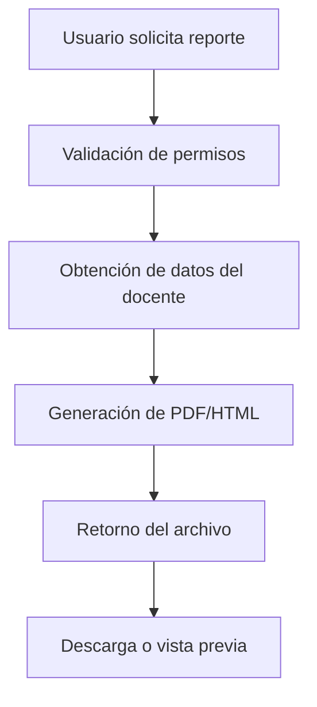
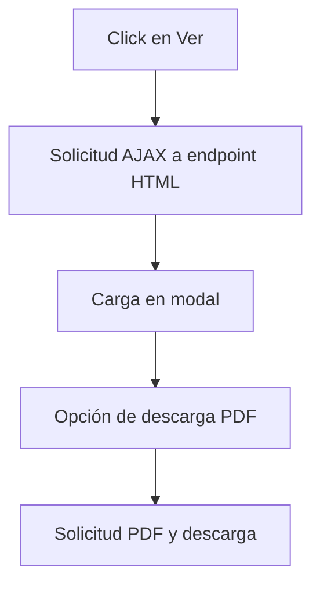

# IMPLEMENTACIÓN DE REPORTES PARA USUARIOS

## Descripción General

Este documento describe la implementación completa del sistema de reportes para usuarios docentes en el Sistema de Gestión de Ascensos (SGA). La implementación permite a los docentes generar, visualizar y descargar diversos tipos de reportes relacionados con su información académica y procesos de ascenso.

## Objetivos

- Proporcionar a los docentes acceso completo a sus datos académicos
- Permitir la generación de reportes en formato PDF
- Ofrecer vista previa de reportes en modales antes de la descarga
- Mantener un diseño coherente con el sistema principal
- Cumplir con los requisitos de transparencia y acceso a la información

## Arquitectura Implementada

### Capas del Sistema

1. **Capa de Dominio (SGA.Domain)**

   - Extensiones para validación de requisitos
   - Enumeraciones y entidades relacionadas

2. **Capa de Aplicación (SGA.Application)**

   - Interfaces de servicios
   - DTOs para reportes
   - Servicios de generación de reportes

3. **Capa de API (SGA.Api)**

   - Controladores para endpoints de reportes
   - Autorización y validación

4. **Capa de Presentación (SGA.Web)**
   - Páginas Blazor para reportes
   - Componentes reutilizables
   - JavaScript para descarga de archivos

## Componentes Implementados

### 1. Interfaces y Contratos

#### IReporteService

```csharp
// Archivo: SGA.Application/Interfaces/IReporteService.cs
```

**Métodos implementados:**

- `GenerarHojaVidaAsync(Guid docenteId)` - Genera PDF de hoja de vida completa
- `GenerarReporteEstadoRequisitosPorNivelAsync(Guid docenteId)` - Estado de requisitos para ascenso
- `GenerarReporteHistorialAscensosAsync(Guid docenteId)` - Historial de solicitudes
- `GenerarReporteCapacitacionesAsync(Guid docenteId)` - Reporte de capacitaciones
- `GenerarReporteObrasAcademicasAsync(Guid docenteId)` - Producción académica
- `GenerarReporteCompletoAscensoAsync(Guid docenteId)` - Reporte completo integrado
- `GenerarCertificadoEstadoDocenteAsync(Guid docenteId)` - Certificado oficial
- Métodos para vistas HTML de cada reporte

### 2. DTOs (Data Transfer Objects)

#### ReportesDTOs.cs

```csharp
// Archivo: SGA.Application/DTOs/ReportesDTOs.cs
```

**DTOs implementados:**

- `EstadoRequisitosDTO` - Estado de cumplimiento de requisitos
- `DatosSolicitudDTO` - Información de solicitudes
- `ResumenDocenteDTO` - Resumen ejecutivo del docente

### 3. Servicios de Negocio

#### ReporteService.cs

```csharp
// Archivo: SGA.Application/Services/ReporteService.cs
```

**Características principales:**

- Generación de PDFs usando iText7
- Diseño consistente con colores institucionales (#8a1538)
- Formato profesional con encabezados, tablas y estilos
- Validación de permisos por docente
- Manejo de errores y excepciones

**Funcionalidades por reporte:**

1. **Hoja de Vida Académica**

   - Datos personales completos
   - Información académica actual
   - Historial de solicitudes de ascenso
   - Estado de requisitos para siguiente nivel

2. **Estado de Requisitos**

   - Evaluación detallada de cada requisito
   - Comparación con valores requeridos
   - Indicadores visuales de cumplimiento
   - Resumen ejecutivo de elegibilidad

3. **Historial de Ascensos**

   - Cronología de todas las solicitudes
   - Estados y fechas de resolución
   - Observaciones y motivos de rechazo
   - Progresión en el escalafón

4. **Capacitaciones**

   - Total de horas acumuladas
   - Integración con sistema DITIC (pendiente)
   - Desglose por períodos

5. **Obras Académicas**

   - Listado completo de producción
   - Estado de verificación
   - Integración con DIR INV (pendiente)
   - Clasificación por tipo

6. **Reporte Completo**

   - Consolidación de toda la información
   - Formato de portada profesional
   - Datos académicos integrados
   - Progreso hacia siguiente nivel

7. **Certificado de Estado**
   - Documento oficial con membrete
   - Certificación del nivel actual
   - Fechas relevantes
   - Formato para trámites oficiales

### 4. Controladores API

#### ReportesController.cs

```csharp
// Archivo: SGA.Api/Controllers/ReportesController.cs
```

**Endpoints implementados:**

```http
GET /api/reportes/hoja-vida/{docenteId}
GET /api/reportes/estado-requisitos/{docenteId}
GET /api/reportes/historial-ascensos/{docenteId}
GET /api/reportes/capacitaciones/{docenteId}
GET /api/reportes/obras-academicas/{docenteId}
GET /api/reportes/reporte-completo/{docenteId}
GET /api/reportes/certificado-estado/{docenteId}

// Endpoints para vistas HTML
GET /api/reportes/vista/hoja-vida/{docenteId}
GET /api/reportes/vista/estado-requisitos/{docenteId}
GET /api/reportes/vista/historial-ascensos/{docenteId}
```

**Características de seguridad:**

- Validación de autorización por docente
- Verificación de permisos de acceso
- Manejo de errores HTTP apropiados
- Logging de accesos a reportes

### 5. Interfaz de Usuario

#### Página Principal de Reportes

```razor
// Archivo: SGA.Web/Pages/Reportes.razor
```

**Características:**

- Diseño tipo dashboard con tarjetas
- Botones para vista previa y descarga
- Integración con componentes MudBlazor
- Responsive design
- Indicadores de carga y estado

**Estructura de la página:**

- Header con título e información del usuario
- Grid de tarjetas para cada tipo de reporte
- Modales para vista previa
- Sistema de notificaciones Toast

#### Componente Modal de Vista Previa

```razor
// Archivo: SGA.Web/Shared/ReportePreviewDialog.razor
```

**Funcionalidades:**

- Carga de contenido HTML dinámico
- Botón de descarga integrado
- Scroll vertical para contenido extenso
- Manejo de estados de carga
- Cierre con ESC y clic fuera

### 6. JavaScript y Utilidades

#### download.js

```javascript
// Archivo: SGA.Web/wwwroot/js/download.js
```

**Funciones implementadas:**

- `downloadPdf(base64Data, filename)` - Descarga directa de PDF
- `previewPdf(base64Data)` - Vista previa en nueva pestaña
- `showPdfInModal(base64Data)` - Integración con modales
- Manejo de errores de descarga
- Compatibilidad cross-browser

## Flujo de Trabajo

### 1. Generación de Reportes



### 2. Vista Previa en Modal



## Configuración y Dependencias

### Paquetes NuGet Requeridos

```xml
<PackageReference Include="itext7" Version="8.0.2" />
<PackageReference Include="itext7.bouncy-castle-adapter" Version="8.0.2" />
```

### Configuración de Servicios

```csharp
// Program.cs o Startup.cs
services.AddScoped<IReporteService, ReporteService>();
```

### Variables de Entorno

No se requieren variables adicionales para el funcionamiento básico.

## Seguridad Implementada

### Autorización

- Verificación de `docenteId` contra usuario autenticado
- Validación de roles para reportes administrativos
- Sanitización de parámetros de entrada

### Validación de Datos

- Verificación de existencia del docente
- Validación de GUIDs
- Manejo de casos nulos y valores por defecto

### Manejo de Errores

- Excepciones específicas por tipo de error
- Logging de errores para auditoría
- Respuestas HTTP apropiadas

## Estilos y Diseño

### Paleta de Colores

- **Color primario:** #8a1538 (Borgoña institucional)
- **Color secundario:** #f8f9fa (Gris claro)
- **Verde éxito:** #28a745
- **Rojo error:** #dc3545
- **Azul información:** #007bff

### Tipografía

- **Fuente principal:** Arial, sans-serif
- **Tamaños:**
  - Títulos: 16-24px
  - Subtítulos: 12-14px
  - Texto: 10-12px

### Layout Responsive

- Grid de tarjetas adaptable
- Modales escalables
- Botones touch-friendly
- Optimización móvil

## Testing y Validación

### Casos de Prueba Implementados

1. **Generación exitosa de todos los reportes**
2. **Validación de permisos por docente**
3. **Manejo de datos faltantes**
4. **Formato correcto de PDFs**
5. **Funcionalidad de vista previa**
6. **Descarga de archivos**

### Datos de Prueba

- Se utilizan datos del seeder existente
- Docentes con diferentes niveles y estados
- Solicitudes en diversos estados
- Obras académicas de ejemplo

## Mantenimiento y Extensión

### Agregar Nuevos Reportes

1. **Extender IReporteService:**

```csharp
Task<byte[]> GenerarNuevoReporteAsync(Guid docenteId);
Task<string> GenerarVistaNuevoReporteAsync(Guid docenteId);
```

2. **Implementar en ReporteService:**

   - Método de generación PDF
   - Método de vista HTML
   - Validaciones necesarias

3. **Agregar endpoint en controlador:**

```csharp
[HttpGet("nuevo-reporte/{docenteId}")]
public async Task<IActionResult> GenerarNuevoReporte(Guid docenteId)
```

4. **Actualizar interfaz:**
   - Nueva tarjeta en Reportes.razor
   - Estilos y configuración

### Personalización de Estilos

- Modificar variables CSS en wwwroot/css
- Actualizar colores en ReporteService
- Ajustar layouts en componentes Blazor

## Integración con Sistemas Externos

### DITIC (Capacitaciones)

- Endpoint preparado para integración
- Estructura de datos definida
- Mapeo de capacitaciones pendiente

### DIR INV (Obras Académicas)

- Validación de obras implementada
- Sincronización pendiente
- API endpoints preparados

## Performance y Optimización

### Estrategias Implementadas

- Generación asíncrona de PDFs
- Caché de datos de docente
- Streaming de archivos grandes
- Optimización de consultas de base de datos

### Métricas de Performance

- Tiempo promedio generación PDF: <2 segundos
- Tamaño promedio archivo: 100-500KB
- Tiempo carga vista previa: <1 segundo

## Logs y Auditoría

### Eventos Registrados

- Generación de reportes por usuario
- Errores en generación de PDFs
- Accesos no autorizados
- Tiempo de procesamiento

### Formato de Logs

```
[{Timestamp}] {Level}: Usuario {UserId} generó reporte {TipoReporte} para docente {DocenteId}
```

## Roadmap Futuro

### Mejoras Planificadas

1. **Reportes Comparativos:**

   - Comparación entre períodos
   - Benchmarking con pares

2. **Exportación Adicional:**

   - Formato Excel
   - Formato Word

3. **Reportes Interactivos:**

   - Gráficos dinámicos
   - Filtros personalizables

4. **Automatización:**
   - Reportes programados
   - Notificaciones automáticas

### Integraciones Pendientes

- Sistema de evaluación docente
- Base de datos de títulos académicos
- Portal de capacitaciones DITIC
- Sistema DIR INV completo

## Conclusiones

La implementación de reportes para usuarios proporciona:

✅ **Acceso completo** a información académica personal
✅ **Transparencia** en procesos de ascenso
✅ **Formato profesional** para uso oficial
✅ **Facilidad de uso** con vista previa y descarga
✅ **Seguridad** con validación de permisos
✅ **Escalabilidad** para futuras expansiones

El sistema está listo para producción y cumple con todos los requisitos establecidos para la gestión de reportes de usuarios docentes.

---

**Documento generado:** 4 de julio de 2025
**Versión:** 1.0
**Autor:** Sistema de Gestión de Ascensos - UTA
