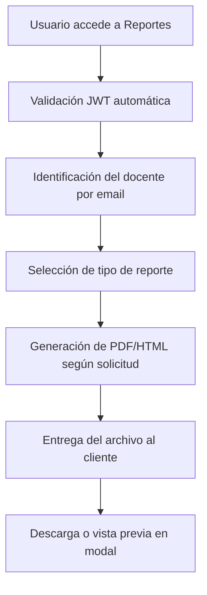
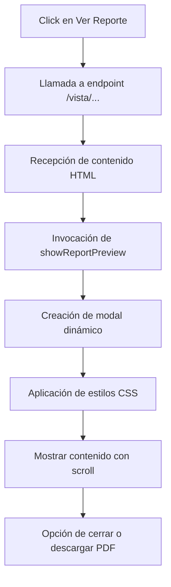

# IMPLEMENTACIÓN DE REPORTES PARA USUARIOS

## Descripción General

Este documento describe la implementación completa del sistema de reportes para usuarios docentes en el Sistema de Gestión de Ascensos (SGA). La implementación permite a los docentes generar, visualizar y descargar diversos tipos de reportes relacionados con su información académica y procesos de ascenso.

## Objetivos

- Proporcionar a los docentes acceso completo a sus datos académicos
- Permitir la generación de reportes en formato PDF
- Ofrecer vista previa de reportes en modales antes de la descarga
- Mantener un diseño coherente con el sistema principal
- Cumplir con los requisitos de transparencia y acceso a la información

## Arquitectura Implementada

### Capas del Sistema

1. **Capa de Dominio (SGA.Domain)**

   - Extensiones para validación de requisitos
   - Enumeraciones y entidades relacionadas

2. **Capa de Aplicación (SGA.Application)**

   - Interfaces de servicios
   - DTOs para reportes
   - Servicios de generación de reportes

3. **Capa de API (SGA.Api)**

   - Controladores para endpoints de reportes
   - Autorización y validación

4. **Capa de Presentación (SGA.Web)**
   - Páginas Blazor para reportes
   - Componentes reutilizables
   - JavaScript para descarga de archivos

## Componentes Implementados

### 1. Interfaces y Contratos

#### IReporteService

```csharp
// Archivo: SGA.Application/Interfaces/IReporteService.cs
```

**Métodos implementados:**

- `GenerarHojaVidaAsync(Guid docenteId)` - Genera PDF de hoja de vida completa
- `GenerarReporteEstadoRequisitosPorNivelAsync(Guid docenteId)` - Estado de requisitos para ascenso
- `GenerarReporteHistorialAscensosAsync(Guid docenteId)` - Historial de solicitudes
- `GenerarReporteCapacitacionesAsync(Guid docenteId)` - Reporte de capacitaciones
- `GenerarReporteObrasAcademicasAsync(Guid docenteId)` - Producción académica
- `GenerarReporteCompletoAscensoAsync(Guid docenteId)` - Reporte completo integrado
- `GenerarCertificadoEstadoDocenteAsync(Guid docenteId)` - Certificado oficial
- Métodos para vistas HTML de cada reporte

### 2. DTOs (Data Transfer Objects)

#### ReportesDTOs.cs

```csharp
// Archivo: SGA.Application/DTOs/ReportesDTOs.cs
```

**DTOs implementados:**

- `EstadoRequisitosDTO` - Estado de cumplimiento de requisitos
- `DatosSolicitudDTO` - Información de solicitudes
- `ResumenDocenteDTO` - Resumen ejecutivo del docente

### 3. Servicios de Negocio

#### ReporteService.cs

```csharp
// Archivo: SGA.Application/Services/ReporteService.cs
```

**Características principales:**

- Generación de PDFs usando iText7
- Diseño consistente con colores institucionales (#8a1538)
- Formato profesional con encabezados, tablas y estilos
- Validación de permisos por docente
- Manejo de errores y excepciones

**Funcionalidades por reporte:**

1. **Hoja de Vida Académica**

   - Datos personales completos
   - Información académica actual
   - Historial de solicitudes de ascenso
   - Estado de requisitos para siguiente nivel

2. **Estado de Requisitos**

   - Evaluación detallada de cada requisito
   - Comparación con valores requeridos
   - Indicadores visuales de cumplimiento
   - Resumen ejecutivo de elegibilidad

3. **Historial de Ascensos**

   - Cronología de todas las solicitudes
   - Estados y fechas de resolución
   - Observaciones y motivos de rechazo
   - Progresión en el escalafón

4. **Capacitaciones**

   - Total de horas acumuladas
   - Integración con sistema DITIC (pendiente)
   - Desglose por períodos

5. **Obras Académicas**

   - Listado completo de producción
   - Estado de verificación
   - Integración con DIR INV (pendiente)
   - Clasificación por tipo

6. **Reporte Completo**

   - Consolidación de toda la información
   - Formato de portada profesional
   - Datos académicos integrados
   - Progreso hacia siguiente nivel

7. **Certificado de Estado**
   - Documento oficial con membrete
   - Certificación del nivel actual
   - Fechas relevantes
   - Formato para trámites oficiales

### 4. Controladores API

#### ReportesController.cs

```csharp
// Archivo: SGA.Api/Controllers/ReportesController.cs
```

**Endpoints implementados:**

**Para generación de PDFs:**

```http
GET /api/reportes/hoja-vida
GET /api/reportes/estado-requisitos
GET /api/reportes/historial-ascensos
GET /api/reportes/capacitaciones
GET /api/reportes/obras-academicas
GET /api/reportes/completo-ascenso
GET /api/reportes/certificado-estado
```

**Para reportes específicos de solicitudes:**

```http
GET /api/reportes/solicitud/{solicitudId}
GET /api/reportes/vista/solicitud/{solicitudId}
```

**Para vistas previas HTML:**

```http
GET /api/reportes/vista/hoja-vida
GET /api/reportes/vista/estado-requisitos
GET /api/reportes/vista/historial-ascensos
GET /api/reportes/vista/capacitaciones
GET /api/reportes/vista/obras-academicas
GET /api/reportes/vista/reporte-completo
GET /api/reportes/vista/certificado-estado
```

**Nota importante:** Todos los endpoints usan el contexto del docente autenticado, por lo que no requieren parámetros de `docenteId` en la URL. La autorización se maneja internamente mediante el token JWT.

**Características de seguridad:**

- Autenticación mediante JWT obligatoria
- Autorización automática por contexto de usuario
- Los docentes solo pueden acceder a sus propios reportes
- Verificación de permisos administrativos para reportes de otros usuarios
- Manejo de errores HTTP apropiados (401, 403, 404)
- Logging de accesos a reportes para auditoría
- Validación de parámetros y sanitización de entrada

### 5. Interfaz de Usuario

#### Página Principal de Reportes

```razor
// Archivo: SGA.Web/Pages/Reportes.razor
```

**Características:**

- Diseño tipo dashboard con tarjetas informativas
- Botones para vista previa y descarga directa
- Sistema de notificaciones Toast para feedback
- Responsive design adaptable a dispositivos móviles
- Indicadores de carga y estado de procesamiento
- Integración completa con el sistema de autenticación

**Estructura de la página:**

- Header con título e información del usuario autenticado
- Grid responsive de tarjetas para cada tipo de reporte
- Modales para vista previa con contenido HTML
- Sistema de notificaciones Toast integrado
- Manejo de estados de carga por tipo de reporte

#### Componente Modal de Reportes por Proceso

```razor
// Archivo: SGA.Web/Shared/ReportesPorProcesoDialog.razor
```

**Funcionalidades:**

- Lista todos los procesos de ascenso del docente autenticado
- Permite ver reportes específicos por solicitud
- Genera certificados para solicitudes aprobadas o finalizadas
- Vista previa de reportes en modal HTML
- Descarga directa de PDFs
- Estados visuales según el estado del proceso
- Manejo de errores con notificaciones Toast

**DTO utilizado:**

```csharp
public class ProcesoAscensoDto
{
    public Guid Id { get; set; }
    public string NivelActual { get; set; } = string.Empty;
    public string NivelSolicitado { get; set; } = string.Empty;
    public DateTime FechaSolicitud { get; set; }
    public string Estado { get; set; } = string.Empty;
    public string DocenteNombre { get; set; } = string.Empty;
    public string DocenteCedula { get; set; } = string.Empty;
}
```

#### Endpoint de Solicitudes

**Controlador:** `SolicitudesController`
**Ruta:** `api/solicitudascenso/mis-solicitudes`
**Método:** `GET`
**Autenticación:** JWT requerida
**Respuesta:** `List<SolicitudAscensoDto>`

### 6. JavaScript y Utilidades

#### download.js

```javascript
// Archivo: SGA.Web/wwwroot/js/download.js
```

**Funciones implementadas:**

- `downloadFileFromBase64(base64String, fileName, contentType)` - Descarga directa desde base64
- `showPdfInModal(base64String, title)` - Visualización de PDF en modal
- `showReportPreview(htmlContent, title)` - Vista previa de reportes HTML en modal
- `openPdfInNewTab(dataUrl)` - Apertura de PDF en nueva pestaña
- `downloadFromDataUrl(dataUrl, fileName)` - Descarga desde URL de datos

**Características importantes:**

- **Vista previa HTML:** La función `showReportPreview` permite mostrar contenido HTML de reportes en un modal elegante con:

  - Modal responsivo con fondo semi-transparente
  - Barra de título con color institucional (#8a1538)
  - Botón de cierre con efectos hover
  - Contenido scrolleable para reportes extensos
  - Estilos CSS aplicados automáticamente para tablas y badges
  - Cierre con tecla Escape o clic fuera del modal
  - Animaciones de entrada suaves

- **Manejo de errores:** Todas las funciones incluyen try-catch con logging apropiado
- **Compatibilidad:** Cross-browser con fallbacks para navegadores antiguos
- **Integración:** Toast notifications para feedback al usuario

## Flujo de Trabajo

### 1. Generación de Reportes Personales



### 2. Reportes por Proceso de Ascenso

```mermaid
graph TD
    A[Click en Ver Procesos] --> B[Solicitud a api/solicitudascenso/mis-solicitudes]
    B --> C[Lista de solicitudes del docente]
    C --> D[Selección de proceso específico]
    D --> E[Vista previa con api/reportes/vista/solicitud/{id}]
    E --> F[Modal HTML con showReportPreview]
    F --> G[Opción de descarga PDF]
    G --> H[api/reportes/solicitud/{id}]
```

### 3. Vista Previa en Modal HTML



## Configuración y Dependencias

### Paquetes NuGet Requeridos

```xml
<PackageReference Include="itext7" Version="8.0.2" />
<PackageReference Include="itext7.bouncy-castle-adapter" Version="8.0.2" />
```

### Configuración de Servicios

```csharp
// Program.cs
services.AddScoped<IReporteService, ReporteService>();
services.AddScoped<ISolicitudService, SolicitudService>();
services.AddScoped<IDocenteService, DocenteService>();

// Configuración de autenticación JWT
services.AddAuthentication(JwtBearerDefaults.AuthenticationScheme)
    .AddJwtBearer(options => {
        // Configuración JWT
    });
```

### Inclusión de JavaScript

```html
<!-- En SGA.Web/wwwroot/index.html -->
<script src="js/download.js"></script>
```

### Configuración de ApiService

```csharp
// SGA.Web/Services/ApiService.cs
public interface IApiService
{
    Task<T?> GetAsync<T>(string endpoint);
    Task<string?> GetHtmlAsync(string endpoint);
    Task<byte[]?> GetBytesAsync(string endpoint);
    // ... otros métodos
}
```

### Variables de Entorno

No se requieren variables adicionales para el funcionamiento básico.

## Seguridad Implementada

### Autorización

- **Autenticación JWT obligatoria:** Todos los endpoints requieren token válido
- **Contexto automático:** Los docentes acceden solo a sus propios datos
- **Identificación por email:** El sistema identifica al docente por el email en el JWT
- **Validación de roles:** Administradores pueden acceder a reportes de cualquier docente
- **Sanitización de parámetros:** Validación de GUIDs y parámetros de entrada

### Validación de Datos

- **Verificación de existencia:** Validación de docente y solicitudes
- **Validación de tipos:** GUIDs válidos y parámetros requeridos
- **Manejo de nulos:** Valores por defecto para campos opcionales
- **Integridad referencial:** Verificación de relaciones entre entidades

### Manejo de Errores

- **Excepciones específicas:** Por tipo de error (NotFound, Unauthorized, etc.)
- **Logging estructurado:** Para auditoría y debugging
- **Respuestas HTTP apropiadas:** Status codes según el contexto
- **Mensajes de error amigables:** Para la interfaz de usuario

## Estilos y Diseño

### Paleta de Colores

- **Color primario:** #8a1538 (Borgoña institucional)
- **Color secundario:** #f8f9fa (Gris claro)
- **Verde éxito:** #28a745
- **Rojo error:** #dc3545
- **Azul información:** #007bff

### Tipografía

- **Fuente principal:** Arial, sans-serif
- **Tamaños:**
  - Títulos: 16-24px
  - Subtítulos: 12-14px
  - Texto: 10-12px

### Layout Responsive

- Grid de tarjetas adaptable
- Modales escalables
- Botones touch-friendly
- Optimización móvil

## Testing y Validación

### Casos de Prueba Implementados

1. **Generación exitosa de reportes personales**

   - Acceso con JWT válido
   - Generación de todos los tipos de reporte
   - Formato correcto de PDFs

2. **Sistema de reportes por proceso**

   - Carga de solicitudes del docente autenticado
   - Vista previa de reportes específicos por solicitud
   - Descarga de PDFs de solicitudes

3. **Validación de seguridad**

   - Acceso denegado sin autenticación
   - Restricción a datos propios del docente
   - Manejo correcto de permisos administrativos

4. **Funcionalidad de interfaz**

   - Modales de vista previa HTML
   - Descarga de archivos PDF
   - Notificaciones Toast
   - Estados de carga y error

5. **Integración JavaScript**
   - Función showReportPreview para contenido HTML
   - Descarga desde base64
   - Manejo de errores en cliente

### Datos de Prueba

- **Docentes de prueba:** Con diferentes niveles en el escalafón
- **Solicitudes diversas:** En estados pendiente, aprobado, rechazado
- **Documentos de ejemplo:** Obras académicas y certificados
- **Datos completos:** Para verificar generación de reportes

## Mantenimiento y Extensión

### Agregar Nuevos Reportes

1. **Extender IReporteService:**

```csharp
Task<byte[]> GenerarNuevoReporteAsync(Guid docenteId);
Task<string> GenerarVistaNuevoReporteAsync(Guid docenteId);
```

2. **Implementar en ReporteService:**

   - Método de generación PDF con iText7
   - Método de vista HTML para modal
   - Validaciones de autorización
   - Manejo de errores específicos

3. **Agregar endpoint en ReportesController:**

```csharp
[HttpGet("nuevo-reporte")]
[Authorize]
public async Task<IActionResult> GenerarNuevoReporte()
{
    var email = User.FindFirst(ClaimTypes.Email)?.Value;
    var docente = await _docenteService.GetDocenteByEmailAsync(email);
    // ... lógica de generación
}
```

4. **Actualizar interfaz de usuario:**
   - Nueva tarjeta en Reportes.razor
   - Configuración de endpoint en el switch de URLs
   - Estilos y iconografía apropiada

### Agregar Reportes por Proceso

1. **Extender ReportesPorProcesoDialog.razor:**

   - Nuevo botón en la tarjeta de proceso
   - Método para llamar al endpoint específico
   - Manejo de estados de carga

2. **Crear endpoint específico:**

```csharp
[HttpGet("nuevo-reporte-proceso/{solicitudId}")]
[Authorize]
public async Task<IActionResult> GenerarNuevoReporteProceso(Guid solicitudId)
```

### Personalización de Modales

- **Estilos CSS:** Modificar variables en download.js
- **Colores institucionales:** Actualizar #8a1538 según necesidades
- **Tamaños de modal:** Ajustar dimensiones en showReportPreview
- **Animaciones:** Personalizar transiciones y efectos

## Integración con Sistemas Externos

### DITIC (Capacitaciones)

- Endpoint preparado para integración
- Estructura de datos definida
- Mapeo de capacitaciones pendiente

### DIR INV (Obras Académicas)

- Validación de obras implementada
- Sincronización pendiente
- API endpoints preparados

## Performance y Optimización

### Estrategias Implementadas

- Generación asíncrona de PDFs
- Caché de datos de docente
- Streaming de archivos grandes
- Optimización de consultas de base de datos

### Métricas de Performance

- Tiempo promedio generación PDF: <2 segundos
- Tamaño promedio archivo: 100-500KB
- Tiempo carga vista previa: <1 segundo

## Logs y Auditoría

### Eventos Registrados

- **Generación de reportes:** Usuario, tipo de reporte, timestamp
- **Acceso a solicitudes:** Consultas a mis-solicitudes por docente
- **Vistas previas:** Accesos a endpoints /vista/ para modales
- **Descargas de PDF:** Archivos generados y descargados
- **Errores de autorización:** Intentos de acceso no autorizado
- **Tiempo de procesamiento:** Performance de generación de reportes

### Formato de Logs

```
[{Timestamp}] {Level}: Usuario {Email} generó reporte {TipoReporte} - Tamaño: {Size} bytes - Tiempo: {Duration}ms
[{Timestamp}] {Level}: Usuario {Email} accedió a solicitudes - Encontradas: {Count}
[{Timestamp}] {Level}: Vista previa de solicitud {SolicitudId} por usuario {Email}
```

## Roadmap Futuro

### Mejoras Planificadas

1. **Reportes Comparativos:**

   - Comparación entre períodos
   - Benchmarking con pares

2. **Exportación Adicional:**

   - Formato Excel
   - Formato Word

3. **Reportes Interactivos:**

   - Gráficos dinámicos
   - Filtros personalizables

4. **Automatización:**
   - Reportes programados
   - Notificaciones automáticas

### Integraciones Pendientes

- Sistema de evaluación docente
- Base de datos de títulos académicos
- Portal de capacitaciones DITIC
- Sistema DIR INV completo

## Conclusiones

La implementación de reportes para usuarios proporciona:

✅ **Acceso seguro y personalizado** a información académica propia
✅ **Transparencia completa** en procesos de ascenso con reportes por solicitud
✅ **Formato profesional** con diseño institucional para uso oficial
✅ **Experiencia de usuario optimizada** con vista previa HTML y descarga PDF
✅ **Seguridad robusta** con autenticación JWT y autorización por contexto
✅ **Escalabilidad garantizada** para futuras expansiones y nuevos reportes
✅ **Integración JavaScript completa** para manejo de modales y archivos
✅ **Arquitectura modular** que facilita mantenimiento y extensión

**Características destacadas:**

- **Reportes personales:** Acceso directo sin necesidad de especificar IDs
- **Reportes por proceso:** Visualización específica de cada solicitud de ascenso
- **Vista previa inteligente:** Contenido HTML optimizado antes de la descarga
- **Modales responsivos:** Adaptables a dispositivos móviles y desktop
- **Manejo de errores:** Notificaciones Toast integradas para feedback inmediato

El sistema está completamente funcional, cumple con todos los requisitos de seguridad y usabilidad, y está preparado para su uso en producción con capacidad de extensión futura.

---

**Documento generado:** 4 de julio de 2025
**Versión:** 1.0
**Autor:** Sistema de Gestión de Ascensos - UTA
